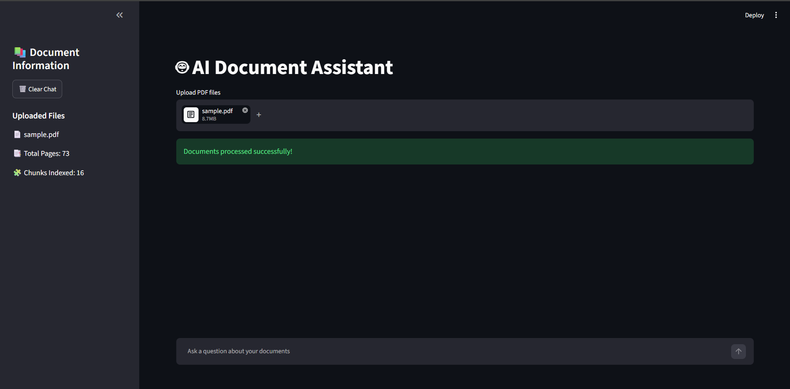
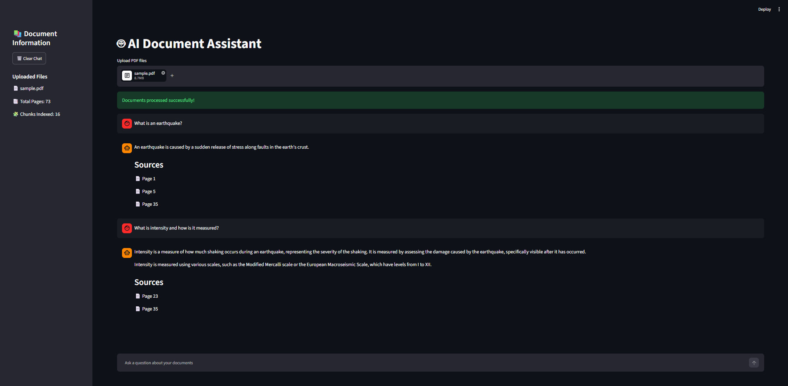

# 🤖 AI-Powered Document Intelligence Platform

A Retrieval-Augmented Generation (RAG) chatbot that allows users to upload PDF documents and ask natural language questions about their contents.

Built using LangChain, ChromaDB, Ollama, and Streamlit, this project performs semantic document retrieval and context-aware answer generation entirely on a local machine without relying on cloud-based AI services.

---

## 🚀 Features

- Upload and analyze PDF documents
- Automatic PDF parsing and text extraction
- Intelligent text chunking
- Semantic search using vector embeddings
- ChromaDB vector database integration
- Retrieval-Augmented Generation (RAG)
- Local LLM inference using Ollama
- Interactive Streamlit chat interface
- Page-level source citations
- Sidebar document analytics
- Fast retrieval using Max Marginal Relevance (MMR)
- Fully local and privacy-preserving workflow

---

## 📸 Screenshots

### PDF Upload & Processing



### Document Question Answering



---

## 🏗️ Architecture

```text
PDF Upload
     ↓
Document Loader
     ↓
Text Chunking
     ↓
Embeddings Generation
     ↓
ChromaDB Vector Store
     ↓
Retriever (MMR)
     ↓
Local LLM (Ollama)
     ↓
Generated Answer + Source Citations
```

---

## 🛠️ Tech Stack

### Frontend
- Streamlit

### AI / LLM
- LangChain
- Ollama
- Llama 3.2 3B

### Vector Database
- ChromaDB

### Embeddings
- Nomic Embed Text

### Language
- Python

---

## 📂 Project Structure

```text
RAG_Chatbot/

├── app.py
├── README.md
├── rag_chatbot.ipynb
│
├── src/
│   ├── pdf_loader.py
│   ├── vector_store.py
│   ├── retriever.py
│   ├── llm.py
│   └── rag_chain.py
│
├── screenshots/
│   ├── upload.png
│   └── chat.png
│
└── uploaded_pdfs/
```

---

## ⚙️ Installation

### Clone Repository

```bash
git clone https://github.com/Sanjeev-Karnatapu/rag-document-chatbot.git
cd rag-document-chatbot
```

### Install Dependencies

```bash
pip install streamlit
pip install langchain
pip install langchain-community
pip install chromadb
pip install pypdf
```

### Install Ollama

Download and install Ollama:

https://ollama.com

Pull the required models:

```bash
ollama pull llama3.2:3b
ollama pull nomic-embed-text
```

---

## ▶️ Run Application

```bash
streamlit run app.py
```

---

## 📈 Performance Optimizations

- Session-state cached retriever
- Session-state cached LLM instance
- MMR retrieval strategy
- Reduced retrieval context size
- Fully local inference using Ollama

---

## 🎯 Future Enhancements

- Persistent vector database
- PDF summarization
- Flashcard generation
- Quiz generation
- FastAPI backend
- Cloud deployment
- Authentication support

---

## 👨‍💻 Author

**Sanjeev Karnatapu**

B.Tech Computer Science Engineering (AI & ML)

Vellore Institute of Technology, Vellore